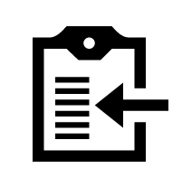
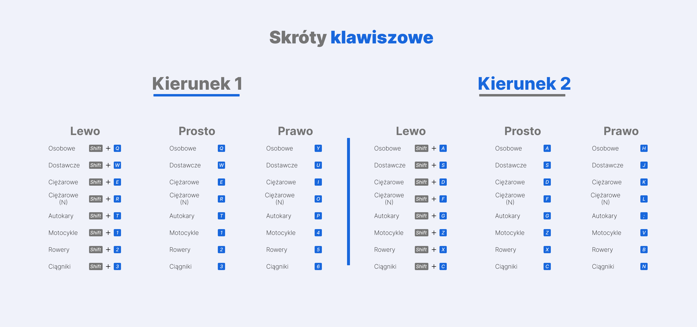

  <h1 align="center">GPR-Counter</h1>

  

    Welcome all recruters to my React.js application created for both personal and commercial purposes.
      The application is complete nearly in 90%, still there are features that I want to implement in future.
      If you got here by accident feel free to leave feedback or report issue.
     
     
    <a href="https://gpr-system-340717.web.app/">View Demo</a>
    ·
    <a href="https://github.com/bajers777/GPR-Counter/issues">Report Bug</a>
    ·
    <a href="https://github.com/bajers777/GPR-Counter/tree/master/src">Check code</a>
  

 
<!-- ABOUT THE PROJECT -->
## About The Project

Since I work additionally doing road traffic measurements, I've created simple counter-like application to help myself and my colleagues.
 
I know how making traffic surveys can be hard and arduous, especially when you work eight or ten hours a day in normal work. Thats why I always look for better and easier ways to make as much surveys as possible. Work smart ~~not~~ **AND** hard!

Main user assumptions:
* User is able to count in 15 minutes intervals,
* Result can be copy and paste to templete Excel file,
* User have always access to counted surveys,
* User can't modify once done survey,

##### not yet implemented feature

> Main admin assumptions:
> - First of all - be able to manage surveys, assign movies to user, send notifications,
> - Can create and manage user account,

### Built With

This section should list any major frameworks/libraries used to bootstrap your project. Leave any add-ons/plugins for the acknowledgements section. Here are a few examples.

* [useForm Hook](https://react-hook-form.com/)
* [React.js](https://reactjs.org/)
* [SCSS](https://sass-lang.com/)
* [Firebase](https://firebase.google.com/)

<!-- GETTING STARTED -->
## Getting Started
Test account:
 
Login: user@test.pl
 
Password: KCLrDb%YE$dl

#### Important!
 Please do not end survey after try counter, as user You can't change survey status, this operation is **permanent.** 
<!-- USAGE EXAMPLES -->
## Usage

After you log in you should be able to select city where measurement is taking place. Use keyshortcuts from below:

<!-- CONTACT -->
## Contact

Łukasz Bajerowski 
 

 l.bajerowski@outlook.com

##### 👍😄
